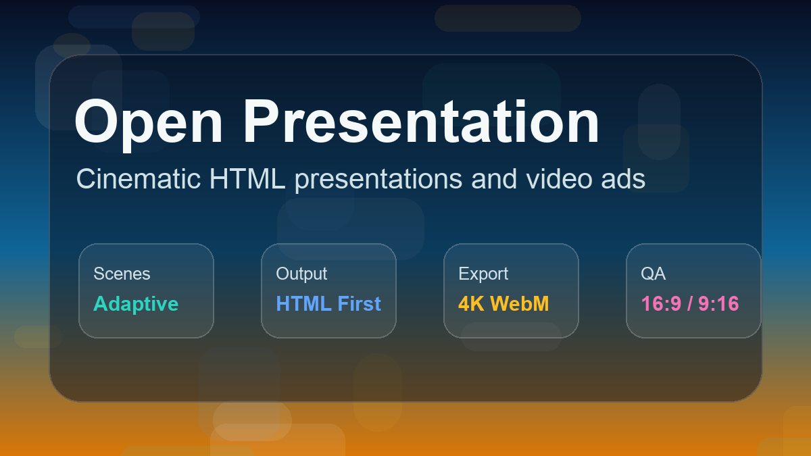
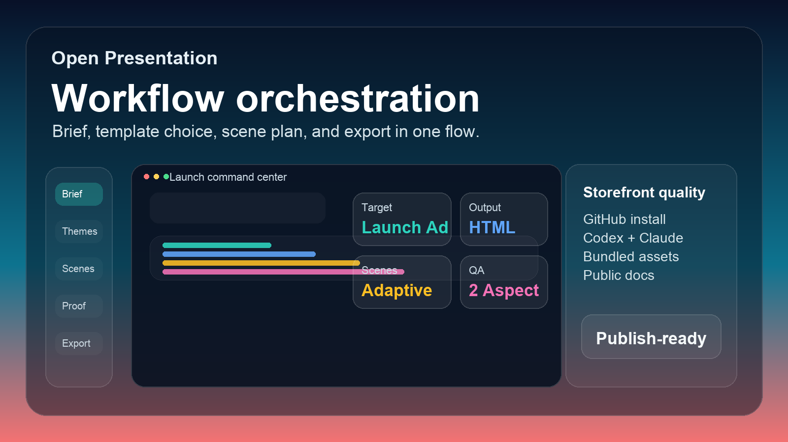

# open-presentation

[](https://github.com/suckseedrom/open-presentation)
[](https://github.com/suckseedrom/open-presentation)
[](https://github.com/suckseedrom/open-presentation)
[](https://github.com/suckseedrom/open-presentation)

Turn raw product briefs, landing pages, code snippets, or simple notes into cinematic, high-fidelity presentation video ads directly inside your codebase. This repo is optimized first for public GitHub installation as an agent plugin, with markdown-skill fallback when the host needs it.

No slides. No generic decks. Just motion-rich presentation systems that frontier AI agent apps can discover, load, and execute from the same portable markdown authority.

---

## Why This Package Exists

- Plugin-first UX for compatible hosts. The preferred install story is a thin agent plugin that exposes this repo's bundled skill and references without adding hidden services or private coupling.
- Markdown-skill fallback. The same package still works as a portable skill install for hosts that do not yet have a plugin surface.
- Zero-dependency HTML delivery. The generated presentation stays compile-free and HTML-first, with optional local player files and optional deterministic 4K export.
- Motion-heavy, text-light storytelling. Scenes stay short, visual, UI-first, and grounded in real product states.
- Closed recheck pass. Delivery remains blocked until every scene passes 16:9 and 9:16 render inspection.

---

## Install

### Public users: GitHub plugin install

Preferred: agent plugin.

If your AI app supports plugin or repo-package installs, use the public GitHub repo as the install source.

Codex CLI:

```bash
codex plugin marketplace add suckseedrom/open-presentation
codex plugin add open-presentation@open-presentation
```

Claude Code:

```text
/plugin marketplace add suckseedrom/open-presentation
```

Then install `open-presentation` from the `open-presentation` marketplace in Claude Code's plugin UI or CLI surface.

If the marketplace appears but the plugin list has not refreshed yet, run:

```text
/reload-plugins
```

This public path works only after the repo branch you point at contains the repo marketplace file and the plugin bundle.

### Maintainers: keep the public path healthy

- keep `SKILL.md` as the workflow entrypoint
- keep `reference/`, `templates/`, `examples/`, and `lib/` bundled and portable
- keep the plugin wrapper thin
- avoid MCP requirements, hidden services, or machine-specific setup
- push the marketplace file and plugin bundle to the public GitHub branch before telling users to install

### Local development

If you prefer a local repo marketplace during development, Codex can add this repo root directly once the repo marketplace file and `plugins/open-presentation/` bundle are present:

```bash
codex plugin marketplace add <repo-root>
codex plugin add open-presentation@open-presentation
```

Codex expects a marketplace source such as `owner/repo`, a Git URL, or a local marketplace path. This repo now ships the required marketplace manifest and plugin manifest so both the public GitHub route and the local dev route work.

### Fallback: markdown skill

```bash
npx skills add suckseedrom/open-presentation
```

### Fallback: repo copy

Clone or copy the repo into a workspace that can read markdown instructions directly. `SKILL.md` remains the entry workflow.

---

## Try It Now

To try the presentation player and its video export, serve the repository over local HTTP and open [`examples/shared-player-example.html`](examples/shared-player-example.html).

Want to see the package in action? Copy one of these starter prompts and paste it into your AI assistant chat in Codex, Claude Code, Cursor, OpenCode, or another compatible frontier agent app:

### Example 1: the product launch ad

> ```text
> Use open-presentation to build a cinematic product launch ad for a new developer tool: "GitPulse" (a real-time interactive git activity dashboard for teams).
> - Product: GitPulse, real-time activity and branch health dashboard
> - Audience: Tech leads and engineering managers who hate merge conflicts
> - Problem: Hidden blocker branches, silent build failures, late alignment
> - Promise: High-velocity team coordination with a living git map
> - Product Flow: 1) Push commit; 2) Live visual pulse on dashboard; 3) Visual branch merge warning; 4) Success pulse
> - CTA: Get started free at gitpulse.dev
> ```

### Example 2: turn a pricing section into a video ad

> ```text
> Use open-presentation to transform our pricing tables into a dynamic, interactive presentation ad.
> - Product: DevHost Cloud
> - Pricing plans: Free ($0, 1 database, 100k requests), Developer ($15/mo, 10 databases, 10M requests, global CDN), Pro ($49/mo, unlimited databases, dedicated cluster, 99.9% SLA).
> - Theme: Capsule (playful, modular card-based UI)
> - Focus: Highlight the Developer tier as the sweet spot. Make the pricing cards animate gracefully and show live stats counting up.
> ```

### Example 3: quick pitch deck from a brief

> ```text
> Use open-presentation to create a zero-dependency HTML pitch deck from our brief:
> - Product: OrbitDB (a decentralized, offline-first database)
> - Problem: Mobile apps lose state and disconnect on trains/planes
> - Promise: Peer-to-peer sync that just works offline and syncs instantly when back online
> - Theme: Cobalt Grid (precise, technical, design-research layout)
> - CTA: Read the whitepaper at orbitdb.org
> ```

## Storefront Preview





## Trust & Support

- [PRIVACY.md](PRIVACY.md) explains the package's no-hidden-service posture and what is controlled by the host app instead.
- [SUPPORT.md](SUPPORT.md) explains where public users should ask for install, generation, player, and export help.

---

## What Ships

- `SKILL.md` is the markdown authority and execution map.
- `manifest.json` advertises plugin-first plus skill-compatible install modes.
- a repo marketplace file makes the repo installable as a Codex marketplace source.
- `plugins/open-presentation/.codex-plugin/plugin.json` is the installable plugin manifest.
- `PRIVACY.md` and `SUPPORT.md` provide public trust and support entrypoints.
- `reference/` holds the shared creative and QA contract.
- `templates/` holds preview-first design packs for progressive disclosure.
- `lib/` ships the local player and optional deterministic 4K export modules.
- `examples/` provides starter prompts and a runnable shared-player example.

## Themes & Design Authorities

Pick a design vibe that matches your brand. You do not need to read all the code. The agent should load only the pieces it needs.

| Theme | Mood & Best For | Key Visual Characteristics | Preview Card |
| :--- | :--- | :--- | :--- |
| **Feature Core** | Adaptive default for product marketing | Clean modern UI mockups, layered reveals, varied active motion | [Preview](templates/presentation-feature-core/preview.md) |
| **Soft Editorial** | Calm, literary, or warm magazine style | Warm paper stocks, serif typography, serene interfaces, quiet pacing | [Preview](templates/soft-editorial/preview.md) |
| **Emerald** | Corporate confidence, bold pitches, reports | Deep emerald and navy tones, bold mastheads, high-contrast stat walls | [Preview](templates/emerald-editorial/preview.md) |
| **Vellum** | Dark, atmospheric, scholarly reflection | Dark vellum backdrop, sparse text, slow-breathing animations | [Preview](templates/vellum/preview.md) |
| **Capsule** | Playful, card-based SaaS features | Rounded cards, card-group layouts, upbeat, interactive steps | [Preview](templates/capsule/preview.md) |
| **Cobalt Grid** | High-structure analytical research | Precise grid lines, crisp technical structures, clean layouts | [Preview](templates/cobalt-grid/preview.md) |

---

## Delivery Model

The generated files are standard, highly readable, and framework-agnostic. The default result is zero-dependency HTML delivery: either a single HTML file with inline CSS and JS or HTML plus the bundled local player files when that fits the workspace better.

```html
<!doctype html>
<html lang="en">
<head>
  <meta charset="utf-8" />
  <meta name="viewport" content="width=device-width, initial-scale=1" />
  <title>GitPulse Launch</title>
  <link rel="stylesheet" href="lib/player.css" />
  <style>
    .scene { font-family: system-ui; text-align: center; }
    .scene h1 { opacity: 0; transform: translateY(20px); transition: 0.6s ease; }
    .scene.active h1 { opacity: 1; transform: translateY(0); }
  </style>
</head>
<body>
  <div id="player"></div>

  <script src="lib/player.js"></script>
  <script>
    new PresentationPlayer(document.getElementById('player'), {
      scenes: [
        {
          id: 'scene-1',
          duration: 5000,
          html: '<div class="scene"><h1>Instant Team Alignment</h1></div>',
          activate: (el) => el.querySelector('.scene').classList.add('active')
        }
      ]
    });
  </script>
</body>
</html>
```

---

## Progressive Disclosure Architecture

This repo is optimized for frontier AI agent apps that can load instructions incrementally instead of swallowing one giant prompt:

```text
open-presentation/
├── README.md               # Consumer-friendly plugin-first overview
├── SKILL.md                # Workflow map and shared agent entrypoint
├── manifest.json           # Plugin-first + skill-compatible package metadata
├── reference/              # Shared authority
│   ├── STYLE_INDEX.md      # Vibe chooser
│   └── PRODUCT_PILLARS.md  # Delivery guarantees
├── templates/              # Compact visual templates
├── lib/                    # Player plus optional video-export modules
└── examples/shared-player-example.html
```

---

## Development and Testing

Verify repository alignment with:

```bash
node tests/architecture.test.mjs
```

Before telling public users to install from GitHub, also verify the public marketplace path from a clean Codex environment:

```bash
codex plugin marketplace add suckseedrom/open-presentation
codex plugin add open-presentation@open-presentation
```

---

<div align="center">
  <sub>Plugin-first, skill-compatible, zero-dependency HTML delivery for modern AI agent apps.</sub>
</div>
