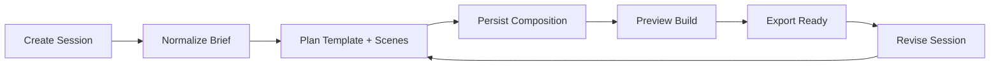

# Runtime Service Spec

This document defines the exact runtime/service needed for `open-presentation` to become a real callable app plugin for Codex and Claude.

It describes the backend and service boundary behind a production `.app.json` binding.

## Scope

The runtime is responsible for:

- session creation
- brief normalization
- template and scene planning
- composition persistence
- HTML preview generation
- export job execution
- revision flows
- host-safe status reporting back to Codex or Claude

It is **not** the source of presentation taste or workflow policy. The source of truth for that remains:

- `SKILL.md`
- `reference/`
- `templates/`
- `core/contracts/composition.schema.json`
- `core/contracts/plugin-session.schema.json`

## Service shape

Recommended deployment:

1. **API service**
- synchronous session and revision endpoints
- auth/session ownership checks
- lightweight persistence orchestration

2. **Render worker**
- preview rendering
- scene QA preparation
- export packaging

3. **Export worker**
- HTML package assembly
- optional 4K video export orchestration

4. **Storage**
- session state
- composition JSON
- preview artifacts
- export artifacts

## Canonical resources

The runtime should model these resources:

- `ProjectSession`
- `Composition`
- `PreviewBuild`
- `ExportJob`
- `WorkspaceWritePlan`

## Session lifecycle



## Required endpoints

These endpoint names are exact recommendations for the production runtime.

### `POST /v1/sessions`

Create a new plugin session from a user brief.

Request:

```json
{
  "host": "codex",
  "briefText": "Use open-presentation to build a launch video ad for Tesla Model 3.",
  "requestedTemplate": "capsule",
  "requestedOutputMode": "html-player"
}
```

Response:

```json
{
  "sessionId": "sess_01j_open_presentation",
  "status": "planning",
  "compositionId": "comp_01j_open_presentation",
  "projectTitle": "Tesla Model 3 launch-video",
  "templateShortlist": [
    "capsule",
    "presentation-feature-core",
    "cobalt-grid"
  ]
}
```

### `GET /v1/sessions/{sessionId}`

Return the current plugin session state using the `plugin-session.schema.json` contract.

### `POST /v1/sessions/{sessionId}/plan`

Finalize or refresh the composition plan from the current brief and options.

Request:

```json
{
  "requestedTemplate": "capsule",
  "aspectTargets": ["16:9", "9:16"]
}
```

Response:

```json
{
  "sessionId": "sess_01j_open_presentation",
  "status": "preview-ready",
  "compositionId": "comp_01j_open_presentation",
  "sceneCount": 5
}
```

### `GET /v1/compositions/{compositionId}`

Return the composition payload using `composition.schema.json`.

### `POST /v1/compositions/{compositionId}/preview`

Trigger preview generation for one or more aspects.

Request:

```json
{
  "aspects": ["16:9", "9:16"],
  "mode": "html-player"
}
```

Response:

```json
{
  "previewBuildId": "prev_01j_open_presentation",
  "status": "queued"
}
```

### `GET /v1/previews/{previewBuildId}`

Return preview status and artifact links.

Response:

```json
{
  "previewBuildId": "prev_01j_open_presentation",
  "status": "completed",
  "artifacts": {
    "htmlPreviewUrl": "https://runtime.example/previews/prev_01j_open_presentation/index.html",
    "thumbnailUrl": "https://runtime.example/previews/prev_01j_open_presentation/thumb.png"
  },
  "qa": {
    "overall": "pass",
    "aspects": {
      "16:9": "pass",
      "9:16": "pass"
    }
  }
}
```

### `POST /v1/compositions/{compositionId}/export`

Start an export job.

Request:

```json
{
  "format": "html-package",
  "aspect": "16:9"
}
```

Or:

```json
{
  "format": "webm-4k",
  "aspect": "16:9"
}
```

Response:

```json
{
  "exportJobId": "exp_01j_open_presentation",
  "status": "queued"
}
```

### `GET /v1/exports/{exportJobId}`

Return export status and artifact metadata.

### `POST /v1/sessions/{sessionId}/revise`

Apply a revision to the current session.

Request:

```json
{
  "revisionPrompt": "Make it more performance-focused and reduce copy density.",
  "requestedTemplate": "cobalt-grid"
}
```

Response:

```json
{
  "sessionId": "sess_01j_open_presentation",
  "status": "planning",
  "compositionId": "comp_01j_open_presentation_v2"
}
```

### `POST /v1/sessions/{sessionId}/workspace-write`

Prepare a concrete write plan for the host workspace.

Response:

```json
{
  "sessionId": "sess_01j_open_presentation",
  "files": [
    "presentation.html",
    "presentation.json",
    "design.md"
  ],
  "status": "ready"
}
```

## Authentication model

Recommended production model:

1. **Host-authenticated session token**
- issued by the host app or connector
- identifies user and workspace/session scope

2. **Short-lived artifact access**
- signed URLs for preview/export artifacts
- no public bucket listing

3. **No cross-user session access**
- session ownership enforced on every `GET` and mutation

## Persistence requirements

Minimum persisted entities:

- `session_id`
- `host`
- `user_id` or host principal
- `brief_text`
- `composition_json`
- `preview_status`
- `export_jobs`
- `artifact_locations`
- `created_at`
- `updated_at`

## Preview generation requirements

Preview should:

- render from the composition contract, not ad hoc chat text
- preserve scene order, motion family, and output mode
- expose separate aspect results for `16:9` and `9:16`
- support plugin-owned preview rendering in the host app

## Export requirements

### HTML package

Must generate:

- `presentation.html`
- optional `lib/` references or inlined player assets
- `presentation.json`
- `design.md`

### 4K video export

Must support:

- queued job state
- progress reporting
- success/failure outcome
- deterministic aspect selection

## Error model

Use structured errors, not plain narration.

Example:

```json
{
  "error": {
    "code": "preview_generation_failed",
    "message": "Preview build failed during scene render.",
    "retryable": true
  }
}
```

Recommended codes:

- `invalid_brief`
- `session_not_found`
- `composition_invalid`
- `preview_generation_failed`
- `export_failed`
- `artifact_expired`
- `host_auth_required`

## Host integration contract

### Codex

The host should be able to:

- create a session from plugin UI
- reopen a session by id
- show preview status
- trigger export
- write outputs into the active workspace

### Claude

The host should be able to:

- create or reopen a session after marketplace install
- recover with `/reload-plugins` when host state is stale
- show plugin-owned preview/export states instead of generic chat-only responses

## Service implementation recommendation

Recommended stack split:

- `api/`
  - session endpoints
  - composition endpoints
  - revision endpoints
- `workers/preview/`
  - HTML preview builds
  - QA preparation
- `workers/export/`
  - package assembly
  - video export orchestration
- `storage/`
  - session records
  - artifacts

## Production-readiness gate

Do not call the plugin “true app-native” until all are true:

1. a real `.app.json` exists with a production id
2. the runtime implements the session/composition/preview/export APIs
3. Codex opens plugin-owned UI and receives structured session state
4. Claude opens plugin-owned UI and receives structured session state
5. preview and export no longer fall back to generic non-renderable text
